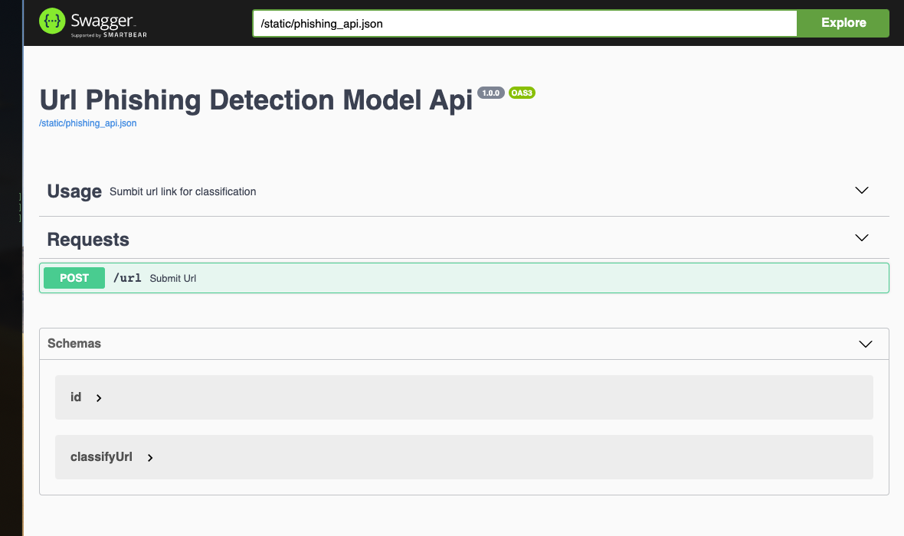

## Overview
This project consist of chrome extension as a frontend and flask backend.

### How chrome extension works
If the url changes on chrome, the extension will send url to backend server. The backend server will check the url whether it is phishing or not and send the result to the chrome extension. Chrome extension will show the dialog if trained model say it is phishing url


Development Packages
    node.js


## How backend works
Backend loads the CNN model and check if requested url is phishing or not. So in order to train the model, we need to extract the features from the dataset. We extract about 91 features from each urls and train a CNN model based on that features.

Development Packages:
    Python, Tensorflow, Keras, Jupyter, Sciki-learn

Dataset:
    - 4000 urls of benign
    - 4000 urls of phishing urls
    - We 91 extract features from each url. Features would be hostname, domain, ip, etc

CNN archituecture:
    - CONV -> ACT -> POOL -> ACT


## Dev Environment Set-up

```bash
$ sudo apt-get update && sudo apt-get upgrade
$ sudo apt-get install virtualenv python3 python3-dev python-dev gcc libpq-dev libssl-dev libffi-dev build-essentials
$ virtualenv -p /usr/bin/python3 .env
$ source .env/bin/activate
$ pip install -r requirements.txt
```

# **APP 1**  url feature extractor

Extracting features from URLs to build a data set for machine learning. The purpose is to find a machine learning model to predict phishing URLs using CNN (Deep learning method - Convolutional Neural Network)
## How to use
```
python extract <urls_file> <output_file.csv> <phishing True/False>
e.g.  python run.py urls/international/urls-phishing.csv dataset/test.csv True
```

# **APP 2**  model rest api
This launches an end point that will be consumed by the chrome extension. 
The chrome extension will frequently submit a url to the endpoint and receive a probability index indicating the
likelihood of the url being legitimate or phsishing.
## How to use
```bash
$ python app.py
```

Local Web Interface http://0.0.0.0:5005/swagger/   



# **APP 3**  chrome extension
```
cd chrome-ext
npm i
npm run build

import dist folder as chrome extensions
chrome://extensions/
    --> Load Unpacked
    --> Import dist/ folder
```
[source code](chrome-ext/src/background.js)


# **APP 4**  model trainer source code

[PhishingDetectionTrainer.ipynb](PhishingDetectionTrainer.ipynb)


# Appendix 

## Model Architecture
```
source code :: jupyter notebook  PhishingDetectionTrainer.ipynb
```
<table>
<td>

```
model = keras.models.Sequential()
model.add(keras.layers.Conv1D(64, 2, activation="relu", input_shape=(X.shape[1],1)))
model.add(keras.layers.Dense(16, activation="relu"))
model.add(keras.layers.MaxPooling1D())
model.add(keras.layers.Flatten())
model.add(keras.layers.Dense(2, activation = 'softmax'))

Model: "sequential_43"
_________________________________________________________________
Layer (type)                 Output Shape              Param #   
=================================================================
conv1d_39 (Conv1D)           (None, 90, 64)            192       
_________________________________________________________________
dense_65 (Dense)             (None, 90, 16)            1040      
_________________________________________________________________
max_pooling1d_36 (MaxPooling (None, 45, 16)            0         
_________________________________________________________________
flatten_26 (Flatten)         (None, 720)               0         
_________________________________________________________________
dense_66 (Dense)             (None, 2)                 1442      
=================================================================
Total params: 2,674
Trainable params: 2,674
```
### Performace Metrics

```
Test accuracy: 99% 

                    precision recall  f1-score   

(legitimate)0.0     1.00      1.00      1.00       
(phishing)1.0       1.00      1.00      1.00     
```
</td>
</table>

### Core Files
> [app.py, rest api end point](app.py)
> [chrome extension](chrome-ext)
> [features extraction scripts](extract.py)
> [saved pre-trained model](url_phishing.h5)
> .....other files are utility scripts

## Model Features (for each url)
<table>
    <tr>
        <th style="text-align:center" colspan="4">
            <b>LEXICAL</b>
        </th>
    </tr>
    <tr>
        <td>Count (.) in URL</td>
        <td>Count (-) in URL</td>
        <td>Count (_) in URL</td>
        <td>Count (/) in URL</td>
    </tr>
    <tr>
        <td>Count (?) in URL</td>
        <td>Count (=) in URL</td>
        <td>Count (@) in URL</td>
        <td>Count (&) in URL</td>
    </tr>
    <tr>
        <td>Count (!) in URL</td>
        <td>Count ( ) in URL</td>
        <td>Count (~) in URL</td>
        <td>Count (,) in URL</td>
    </tr>
    <tr>
        <td>Count (+) in URL</td>
        <td>Count (*) in URL</td>
        <td>Count (#) in URL</td>
        <td>Count ($) in URL</td>
    </tr>
    <tr>
        <td>Count (%) in URL</td>
        <td>URL LengthL</td>
        <td>TLD amount in URL</td>
        <td>Count (.) in Domain</td>
    </tr>
    <tr>
        <td>Count (-) in Domain</td>
        <td>Count (_) in Domain</td>
        <td>Count (/) in Domain</td>
        <td>Count (?) in Domain</td>
    </tr>
    <tr>
        <td>Count (=) in Domain</td>
        <td>Count (@) in Domain</td>
        <td>Count (&) in Domain</td>
        <td>Count (!) in Domain</td>
    </tr>
    <tr>
        <td>Count ( ) in Domain</td>
        <td>Count (~) in Domain</td>
        <td>Count (,) in Domain</td>
        <td>Count (+) in Domain</td>
    </tr>
    <tr>
        <td>Count (*) in Domain</td>
        <td>Count (#) in Domain</td>
        <td>Count ($) in Domain</td>
        <td>Count (%) in Domain</td>
    </tr>
    <tr>
        <td>Domain Length</td>
        <td>Quantidade de vogais in Domain</td>
        <td>URL domain in IP address format</td>
        <td>Domain contains the key words "server" or "client"</td>
    </tr>
    <tr>
        <td>Count (.) in Directory</td>
        <td>Count (-) in Directory</td>
        <td>Count (_) in Directory</td>
        <td>Count (/) in Directory</td>
    </tr>
    <tr>
        <td>Count (?) in Directory</td>
        <td>Count (=) in Directory</td>
        <td>Count (@) in Directory</td>
        <td>Count (&) in Directory</td>
    </tr>
    <tr>
        <td>Count (!) in Directory</td>
        <td>Count ( ) in Directory</td>
        <td>Count (~) in Directory</td>
        <td>Count (,) in Directory</td>
    </tr>
    <tr>
        <td>Count (+) in Directory</td>
        <td>Count (*) in Directory</td>
        <td>Count (#) in Directory</td>
        <td>Count ($) in Directory</td>
    </tr>
    <tr>
        <td>Count (%) in Directory</td>
        <td>Directory Length</td>
        <td>Count (.) in file</td>
        <td>Count (-) in file</td>
    </tr>
    <tr>
        <td>Count (_) in file</td>
        <td>Count (/) in file</td>
        <td>Count (?) in file</td>
        <td>Count (=) in file</td>
    </tr>
    <tr>
        <td>Count (@) in file</td>
        <td>Count (&) in file</td>
        <td>Count (!) in file</td>
        <td>Count ( ) in file</td>
    </tr>
    <tr>
        <td>Count (~) in file</td>
        <td>Count (,) in file</td>
        <td>Count (+) in file</td>
        <td>Count (*) in file</td>
    </tr>
    <tr>
        <td>Count (#) in file</td>
        <td>Count ($) in file</td>
        <td>Count (%) in file</td>
        <td>File length</td>
    </tr>
    <tr>
        <td>Count (.) in parameters</td>
        <td>Count (-) in parameters</td>
        <td>Count (_) in parameters</td>
        <td>Count (/) in parameters</td>
    </tr>
    <tr>
        <td>Count (?) in parameters</td>
        <td>Count (=) in parameters</td>
        <td>Count (@) in parameters</td>
        <td>Count (&) in parameters</td>
    </tr>
    <tr>
        <td>Count (!) in parameters</td>
        <td>Count ( ) in parameters</td>
        <td>Count (~) in parameters</td>
        <td>Count (,) in parameters</td>
    </tr>
    <tr>
        <td>Count (+) in parameters</td>
        <td>Count (*) in parameters</td>
        <td>Count (#) in parameters</td>
        <td>Count ($) in parameters</td>
    </tr>
    <tr>
        <td>Count (%) in parameters</td>
        <td>Length of parameters</td>
        <td>TLD presence in arguments</td>
        <td>Number of parameters</td>
    </tr>
    <tr>
        <td>Email present at URL</td>
        <td>File extension</td>
    </tr>
</table>

<table>
    <tr>
        <th style="text-align:center" colspan="4">
            <b>HOST</b>
        </th>
    </tr>
    <tr>
        <td>Presence of the domain in RBL (Real-time Blackhole List)</td>
        <td>Search time (response) domain (lookup)</td>
        <td>Domain has SPF?</td>
        <td>Geographical location of IP</td>
    </tr>
    <tr>
        <td>AS Number (or ASN)</td>
        <td>PTR of IP</td>
        <td>Time (in days) of domain activation</td>
        <td>Time (in days) of domain expiration</td>
    </tr>
    <tr>
        <td>Number of resolved IPs</td>
        <td>Number of resolved name servers (NameServers - NS)</td>
        <td>Number of MX Servers</td>
        <td>Time-to-live (TTL) value associated with hostname</td>
    </tr>
</table>

<table>
    <tr>
        <th style="text-align:center" colspan="4">
            <b>OTHERS</b>
        </th>
    </tr>
    <tr>
        <td>Valid TLS / SSL Certificate</td>
        <td>Number of redirects</td>
        <td>Check if URL is indexed on Google</td>
        <td>Check if domain is indexed on Google</td>
    </tr>
    <tr>
        <td>Uses URL shortener service</td>
    </tr>
</table>


